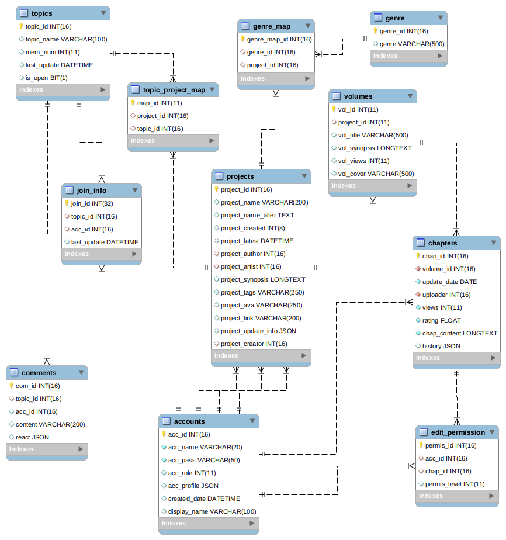

# Backup/Restore Procedure
## Database Data
- MySQL (N2N_v1)
## Update logs
```
- 23th Feb. 2019 - ver1.0 (draft) completed
```
## Database EER



# Database recovery and data import

- Extract zip file
- Create your own database and tables in Idea (table name must match)
- Create an 'application.properties' file in `/snk-demo/src/main/resources`
- Config your properties file in Spring project as following:

